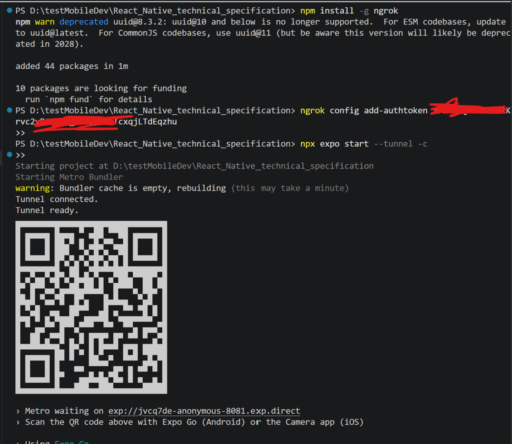
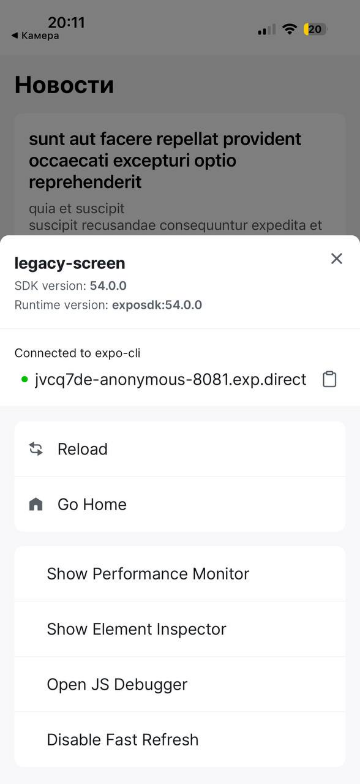
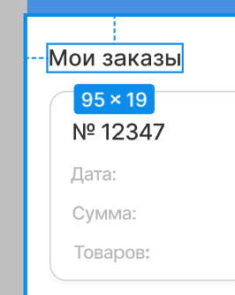

# Тестовое задание React Native / Expo Go

Тестовый проект изначально представлял собой приложение, которое показывает список новостей: загружает данные с публичного тестового API `jsonplaceholder.typicode.com/posts` и отображает их в виде карточек.

## Исходная структура проекта

- `App.tsx` — точка входа, рендерит `LegacyListScreen`.
- `screens/LegacyListScreen.tsx` — экран со списком, где используется `FlatList` и спиннер загрузки.
- `components/animCard.tsx` — карточка новости с анимацией появления через `react-native-reanimated`.
- `utils/api.ts` — один `fetch`-запрос к `jsonplaceholder` за данными.
- `types/NewsItem.ts` — TypeScript-тип новости: `id`, `title`, `body`.

## Подготовка окружения и запуск

Что было сделано:

1. Установлены и проверены зависимости:

```bash
node -v
npm -v
git --version
```

2. Установлен Expo Go из App Store.
3. Склонирован тестовый проект.
4. Установлены зависимости:

```bash
npm install
```

5. Проверена совместимость зависимостей Expo:

```bash
npx expo install --fix
```

6. При запуске через tunnel возникла ошибка, связанная с `ngrok`: в версии 3.x требуется auth token даже для бесплатного использования. Поэтому была выполнена регистрация на [ngrok.com](https://ngrok.com/), получен токен, и после этого tunnel был успешно запущен.



После этого было выполнено тестовое задание.

---

# Часть 1. Доработка и рефакторинг существующего кода


## 1.1. Привести код к стандартам TypeScript

**Требование:** убрать `any`, типизировать пропсы, данные API и хуки, вынести типы в отдельные файлы.

По пункту 1.1 были исправлены `any`-типы в `types/index.ts`. Там вместо `NewsItem = any` и `ApiResponse = any` теперь берётся тип из `types/NewsItem.ts`, а `ApiResponse` описан как `NewsItem[]`.

В `NewsItem` добавлено недостающее поле `userId: number`, так как его возвращает API.

В `utils/api.ts` для `fetchNews` добавлен явный тип возврата `Promise<NewsItem[]>`, а результат `response.json()` явно приведён к `NewsItem[]`.

В `LegacyListScreen.tsx` типизированы все три состояния: `useState<NewsItem[]>`, `useState<boolean>`, `useState<string | null>`, а также `renderItem` и `keyExtractor`.

Из `animCard.tsx` убран неиспользуемый импорт `SlideInLeft`, а из `LegacyListScreen.tsx` — `ScrollView`.

Типы вынесены в отдельную папку `types/` и импортируются явно: `NewsItem` из `types/NewsItem.ts`, а `ApiResponse` через `types/index.ts`.

## 1.2. Доработать API

**Требование:** добавить корректную обработку ошибок сети и статус-кодов, реализовать состояния `loading` и `error`.

В `utils/api.ts` добавлен `try/catch` вокруг вызова `fetch`. Если возникает сетевая ошибка, она перехватывается и возвращает сообщение: `Нет подключения к интернету`.

После получения ответа проверяется `response.ok`. Если сервер вернул статус `4xx` или `5xx`, выводится ошибка с кодом.

В `LegacyListScreen.tsx` было добавлено отдельное состояние `error: string | null` для хранения текста ошибки при неудачной загрузке данных. Загрузка новостей теперь обрабатывается через цепочку `.then().catch().finally()`: успешный ответ записывается в список, ошибка сохраняется в `error`, а `finally` в любом случае выключает `loading`, чтобы не крутить бесконечный спиннер.

На экране добавлены отдельные состояния отображения:

- во время загрузки показывается `ActivityIndicator`;
- при ошибке показывается сообщение об ошибке;
- при успешной загрузке показывается список новостей.

## 1.3. Оптимизировать рендер списка

**Требование:** заменить `ScrollView` на `FlatList`, добавить корректный `keyExtractor`, исключить лишние перерисовки.

Список реализован через `FlatList`, который, в отличие от `ScrollView`, рендерит только видимые элементы. Это важно для списка из 100 постов от API.

Добавлен `keyExtractor` через `item.id.toString()`.

`AnimatedCard` обёрнут в `React.memo`, поэтому компонент не перерисовывается, если его пропсы не изменились.

`useCallback` защищает функции `renderItem` и `keyExtractor` от пересоздания при каждом ререндере экрана.

## 1.4. Реализовать плавную анимацию появления элементов списка

**Требование:** использовать `react-native-reanimated`, выбор анимации — на усмотрение разработчика.

Анимация реализована в `components/animCard.tsx` через `react-native-reanimated`: карточка обёрнута в `Animated.View`, а для появления используется:

```tsx
entering={FadeInDown.delay(...).springify()}
```

## 1.5. Сделать минимум 3 осмысленных Git-коммита

**Требование:** сделать коммиты с описательными сообщениями (`fix:`, `refactor:`, `feat:`).

Было добавлено 4 коммита. Для первой части создана отдельная ветка:

```text
feature/part1-orders
```

## 1.6. Запуск и зависимости

Запуск и зависимости описаны в начале документа. Ниже — скриншоты из запущенного приложения.




---

# Часть 2. Разработка нового экрана «Заказы»

## 2.1. Разработать интерфейс экрана строго по макету

**Требование:** соблюдать отступы и шрифты для Android/iOS.

Экран разработан и проверен через Expo Go.


## Поиск


Кнопка «Обновить» работает как обновление/сброс поиска.



Отступы слева от текста были 15, а ниже у карточки 16, поэтому в реализации везде использовано 16, чтобы отступы были единообразными.

## 2.2. Вывести моковые данные на экран «Заказы»

По пункту 2.2 создан файл `types/Order.ts` с типами `OrderStatus` и `Order`: `id`, номер, статус, дата, сумма, количество.

Создан файл `data/mockOrders.ts` с четырьмя заказами разных статусов. В `OrdersScreen.tsx` мок-данные загружаются в `useState<Order[]>(mockOrders)` и передаются в `FlatList`.

Список фильтруется через `useMemo`, то есть при каждом изменении поиска пересчитывается только отфильтрованный массив, а не перерисовывается весь компонент.

## 2.3. Реализовать управление состоянием

По пункту 2.3 выбран `useState` как инструмент управления состоянием.

В `OrdersScreen` два состояния:

- `orders` — список заказов из мок-данных;
- `search` — строка поискового запроса.

Фильтрация вынесена в `useMemo`, который пересчитывает `filteredOrders` только когда меняется `search` или `orders`. Именно этот производный массив передаётся в `FlatList`, а не исходный.

`Zustand` и `Context` не использовались специально, так как они нужны при разделении состояния между несколькими экранами или компонентами. Здесь вся логика замкнута внутри одного экрана, данные заказов больше нигде не используются, а поиск — это локальное UI-состояние.

`TanStack Query` не использовался, потому что данные моковые и не требуют кеширования или повторных запросов к серверу.

## 2.4. Настроить навигацию между экраном из Части 1 и экраном «Заказы»

Навигация сделана через bottom tabs (`@react-navigation/bottom-tabs`). Создан файл `navigation/AppNavigator.tsx` с `NavigationContainer` и двумя вкладками:

- «Новости»;
- «Заказы».

Для каждой вкладки через `Ionicons` из `@expo/vector-icons` назначена иконка. Активная вкладка подсвечивается голубым цветом, чтобы её можно было отличать.

## 2.5. Сделать минимум 3 осмысленных Git-коммита

Коммиты добавлены. Для второй части создана ветка:

```text
feature/part2-orders
```
